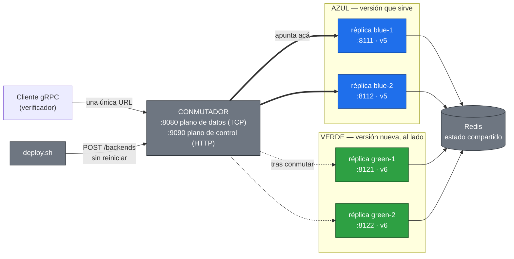
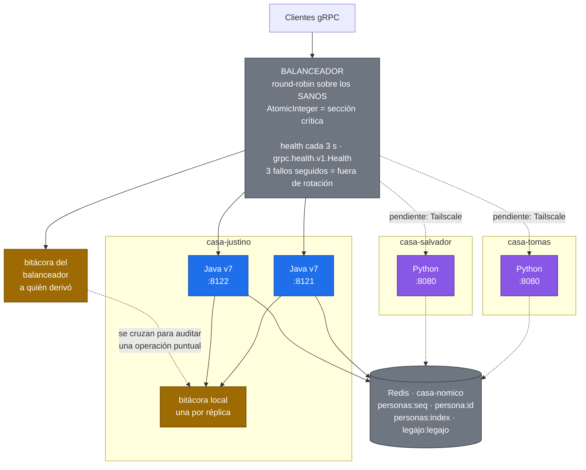
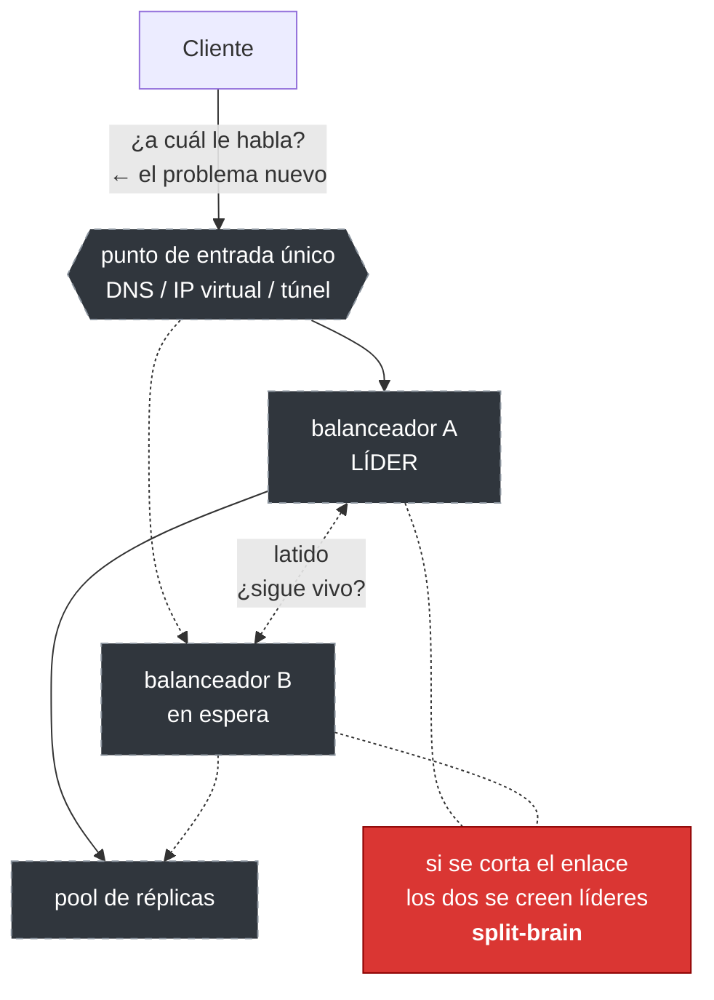
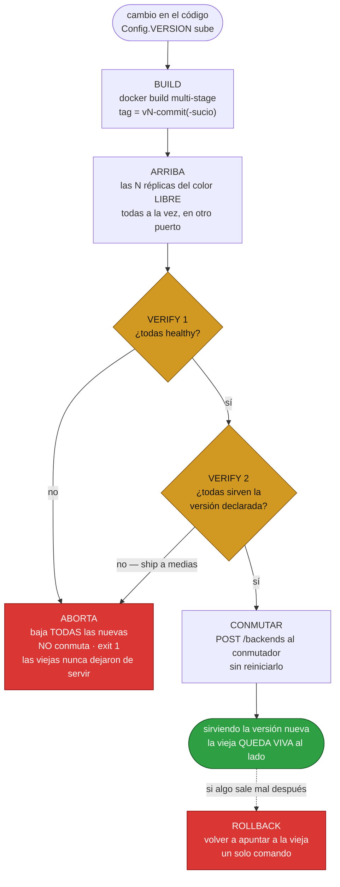
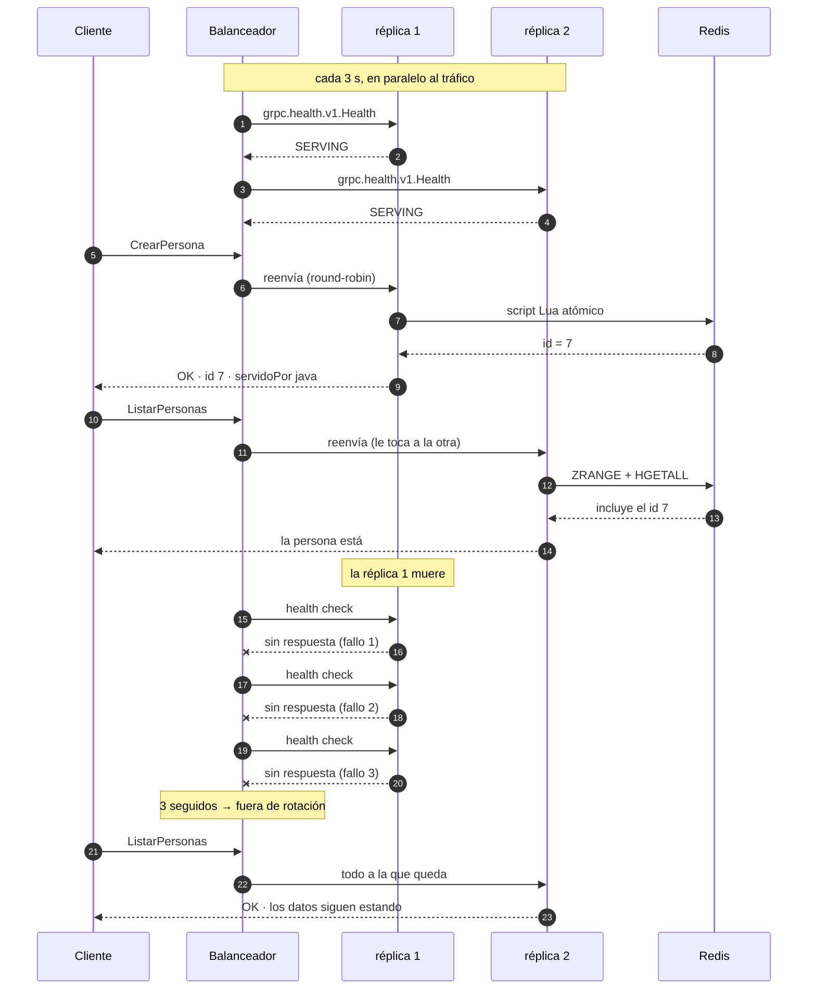
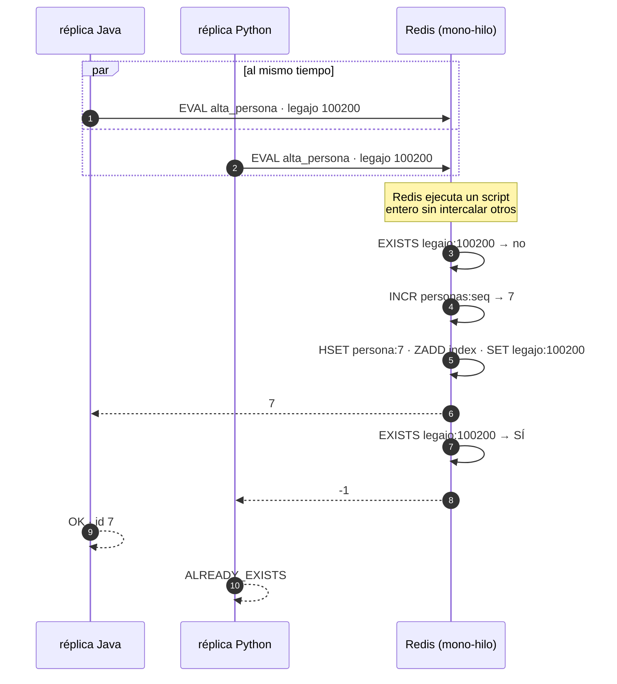
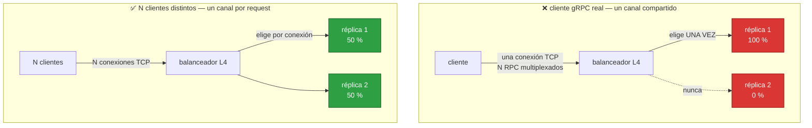
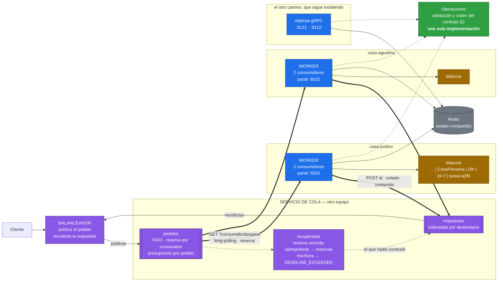
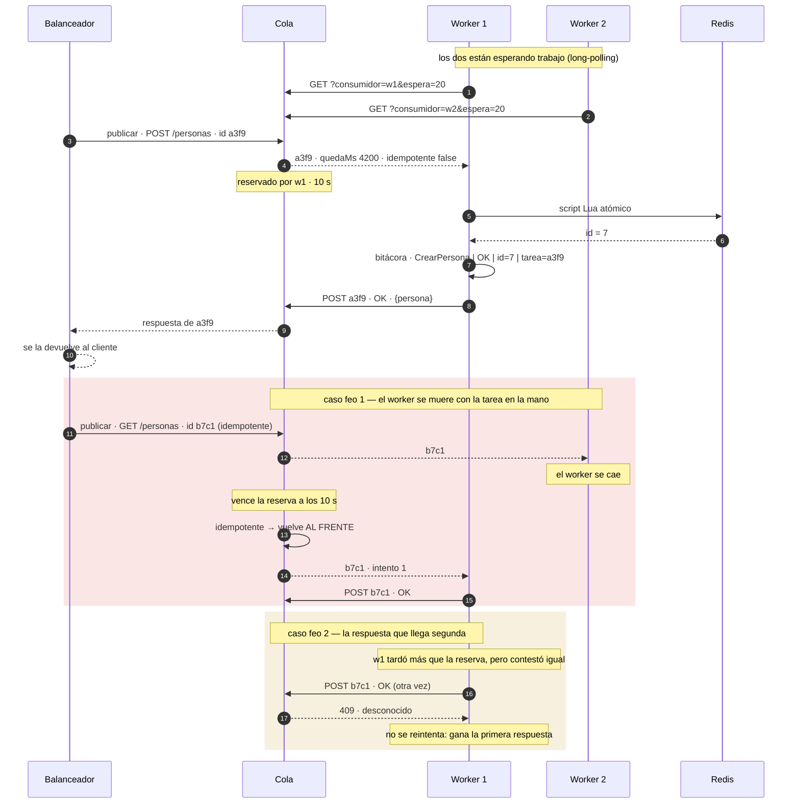

# Diagramas — App Java

Nueve diagramas: la arquitectura de cada etapa, el flujo del deploy, las secuencias que
explican por qué el sistema aguanta, y la arquitectura del **worker de cola** (8 y 9). Lo
que está implementado y medido va en línea llena; lo propuesto, punteado.

---

## 1 · Arquitectura — Etapa 1: un conmutador, dos colores

Termina la pelea por el puerto: una sola URL pública, y detrás dos versiones conviviendo.

**Lo que importa:** el conmutador tiene **dos planos separados**. El de datos reenvía bytes;
el de control escucha aparte, en `127.0.0.1`. Esa separación es lo que permite cambiar de
destino **sin reiniciar** — el deploy le habla al control mientras el de datos sigue
atendiendo.

---

## 2 · Arquitectura — Etapa 2: pool mixto y health checks

El conmutador ya no apunta a un backend: conoce una lista, rota entre ella, y saca de
rotación a la que deja de responder.

**El estado no vive en las réplicas.** Por eso una puede atender el alta y otra la lectura
siguiente, y por eso la que se muere no se lleva nada consigo. El SPOF se mudó: ahora está
en Redis.

---

## 3 · Arquitectura — Etapa 3: replicar al balanceador (propuesta)

Replicar el balanceador no cierra el problema, lo **corre de lugar**: aparece el split-brain
y la pregunta de quién balancea a los balanceadores. En algún punto la cadena se corta con
algo que el cliente ya sabe encontrar solo — DNS, una IP virtual, un túnel.

---

## 4 · Flujo del deploy blue-green — con abort y rollback

**Dos verificaciones, no una.** El health check dice "estoy vivo", no "soy la versión que
pediste": un ship a medias deja un contenedor perfectamente sano corriendo la versión
anterior. Por eso el segundo verify compara la versión que responde `Identidad` contra la
declarada en el código.

**La vieja no se baja al conmutar.** Volver atrás tiene que ser un comando, no un deploy en
reversa.

---

## 5 · Secuencia — reparto, muerte de una réplica y ejección

**Por qué 3 fallos y no 1:** con umbral 1, un pico de latencia o un GC bastan para expulsar
una réplica sana. Nos pasó: bajo carga los chequeos se pasaban de deadline y el pool quedaba
vacío **con las dos réplicas perfectamente vivas**. Expulsar rápido es caro porque achica el
pool; reincorporar rápido es barato, así que alcanza **un** acierto para volver.

---

## 6 · Secuencia — dos réplicas dando de alta el mismo legajo

**Sin atomicidad, las dos ganan.** Entre comprobar que el legajo no está y escribirlo, la
otra réplica se cuela; y entre pedir el `id` y usarlo, la otra pide el mismo. Redis corre el
script entero sin intercalar comandos de otros clientes, así que las cinco operaciones valen
por una — y eso nos ahorra coordinar las casas entre sí.

**Medido:** 25 altas del mismo legajo lanzadas a la vez desde una barrera común →
**1 `OK` y 24 `ALREADY_EXISTS`**.

---

## 7 · El hallazgo: L4 reparte por conexión, no por RPC

Un balanceador **L4 decide por conexión**. Una conexión gRPC es persistente y multiplexada:
el cliente abre un canal y manda todos sus RPC por ahí, así que queda pegado a una réplica.
El contrato lo avisa en §7.3 — acá está medido: **100 % a una sola réplica** con canal
compartido, **50/50 exacto** con canal por request.

Repartir **por RPC** exige subir a L7 y entender HTTP/2. Es la decisión grande que le queda
al equipo Plataforma.

---

## 8 · Arquitectura — el worker de cola

El cliente deja de esperar contra una conexión abierta: su pedido se publica en una cola y
el worker que esté libre lo toma. **Nadie asigna trabajo** — no hay round-robin, no hay
lista de backends, no hay health checks del lado del que reparte.

**Tres cosas que cambian respecto del balanceador de la Etapa 2:**

| | Balanceador (Etapa 2) | Cola (Etapa 4) |
| :--- | :--- | :--- |
| Quién elige | El balanceador, por turno | **El worker libre**, pidiendo trabajo |
| Un worker lento | Recibe igual: le toca por round-robin | Toma menos, porque pide menos |
| Un worker muerto | Hay que detectarlo con health checks | No hace falta: **le vence la reserva** y otro lo toma |

**El worker no escucha ningún puerto de servicio.** Nadie le habla: es él quien va a buscar
trabajo. Por eso se despliega en cualquier casa sin pedirle al equipo de red una IP
alcanzable ni un puerto abierto — sólo necesita *alcanzar* la cola. Lo único que expone es
un panel de sólo lectura para el `HEALTHCHECK` y para mirarlo en la demo.

**Una sola implementación del contrato.** El worker y las réplicas gRPC resuelven con la
misma clase `Operaciones`. Si cada uno validara por su cuenta, la misma alta daría
`INVALID_ARGUMENT` por un camino y `ALREADY_EXISTS` por el otro, y el contrato dejaría de
valer apenas cambia el transporte.

---

## 9 · Secuencia — el ciclo de una tarea, y los dos casos feos

**Por qué una escritura no se reencola.** Al vencer una reserva, la cola sabe que el worker
no contestó — pero no sabe si llegó a ejecutar. Repetir una lectura no cuesta nada; repetir
un alta puede crear la persona dos veces. Por eso lo idempotente vuelve al frente y la
escritura se falla con `DEADLINE_EXCEEDED`: un error honesto es mejor que un duplicado
silencioso. Es la misma decisión que el `legajo` único protege del lado de Redis, ahora un
nivel más arriba.

**Por qué el worker reintenta la respuesta y no la ejecución.** Cuando el POST falla, la
tarea **ya se ejecutó**: si el alta se escribió en la base y la respuesta se pierde, el
cliente recibe un error por algo que sí pasó, y como la cola no reintenta las escrituras,
nadie lo corrige después. Reintentar la ejecución, en cambio, duplicaría el trabajo.
